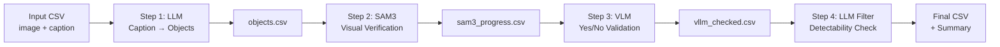

# VPR Quality Pipeline

A multi-stage validation pipeline for creating high-quality Visual Place Recognition (VPR) datasets through automated caption validation and object detection.

## Overview

This pipeline takes image captions and progressively validates them through 4 stages, filtering out false positives and ensuring only accurately detected objects remain:



### Pipeline Stages

1. **Step 1**: Extract objects from captions using text-only LLM
2. **Step 2**: Verify objects visually using SAM3 segmentation model
3. **Step 3**: Validate each object with vision-language model (VLM)
4. **Step 4**: Final detectability filter using text-only LLM

Each stage progressively reduces false positives, ensuring high-quality labeled data for VPR research.

## Key Features

- **Resume Support**: Automatically resume interrupted runs
- **Watch Mode**: Steps 2-4 can watch for new data from previous steps
- **Multi-GPU**: Automatically distributes work across available GPUs
- **Flexible Backends**: Support for local HuggingFace models, OpenAI-compatible APIs, and Google Gemini
- **Quantization**: Optional 4-bit quantization reduces GPU memory by ~75%
- **Configurable**: YAML configuration files for common scenarios

## Quick Start

### Installation

```bash
# Clone the repository
git clone https://github.com/yourusername/vpr-quality-pipeline.git
cd vpr-quality-pipeline

# Create conda environment
conda env create -f environment.yml
conda activate vpr-quality-pipeline

# Or install with pip
pip install -r requirements.txt
```

### Run Example

```bash
# Run on the included 100-sample dataset
./run_pipeline.sh \
  --input_csv examples/sample_input.csv \
  --images_root examples/images \
  --output_dir examples/output
```

## Usage

### Basic Usage (Local/Interactive)

```bash
./run_pipeline.sh \
  --input_csv path/to/your/data.csv \
  --images_root path/to/images \
  --output_dir output
```

### Running on HPC Clusters

#### SLURM

Use the provided SLURM template for the example dataset:

```bash
# 1. Customize the template
cp examples/run_example_on_slurm.sh my_job.sh
# Edit: REPO_ROOT, CONDA_PATH, SBATCH directives

# 2. Create logs directory
mkdir -p logs

# 3. Submit job
sbatch my_job.sh

# 4. Monitor progress
tail -f logs/example_*.out

# 5. Check results after completion
cat examples/output/filtered_summary.csv
```

For your own dataset, customize the script to call `run_pipeline.sh` with your paths:

```bash
#!/bin/bash
#SBATCH --gres=gpu:1
#SBATCH --mem=24G
#SBATCH --time=8:00:00

source ~/anaconda3/etc/profile.d/conda.sh
conda activate vpr-quality-pipeline
cd /path/to/vpr-quality-pipeline

./run_pipeline.sh \
  --input_csv /path/to/your/data.csv \
  --images_root /path/to/images \
  --output_dir /path/to/output \
  --resume
```

**Resource Guidelines**:
- 100 images: 1 GPU, 16GB RAM, 1-2 hours
- 1000 images: 1 GPU, 24GB RAM, 8-12 hours
- 5000+ images: 2-4 GPUs, 32GB RAM, 24-48 hours

### With Configuration File

```bash
# Use GPU-optimized config
./run_pipeline.sh \
  --input_csv data.csv \
  --config configs/gpu_config.yaml

# Use CPU-only config
./run_pipeline.sh \
  --input_csv data.csv \
  --config configs/cpu_config.yaml
```

### Resume Interrupted Run

```bash
./run_pipeline.sh \
  --input_csv data.csv \
  --output_dir output \
  --resume
```

### Advanced Options

```bash
./run_pipeline.sh \
  --input_csv data.csv \
  --step1_use_4bit \              # Reduce GPU memory for Step 1
  --sam3_box_threshold 0.3 \      # Higher threshold = stricter
  --vllm_prompt_style describe_then_yesno \  # More thorough VLM prompt
  --filter_device cuda \           # Run Step 4 on GPU
  --filter_batch_size 128
```

See `./run_pipeline.sh --help` for all options.

## Input Format

Your input CSV must have these columns:

- `image_path`: Path to image (absolute or relative to `--images_root`)
- `description`: Caption/description of the image

Example:

```csv
image_path,description
database/img001.jpg,"Red brick building with white windows and a blue door"
queries/img002.jpg,"Street scene with trees and parked cars"
```

## Output Format

The pipeline produces 5 CSV files:

1. **`objects.csv`**: Objects extracted from captions (Step 1)
2. **`sam3_progress.csv`**: Objects verified by SAM3 (Step 2)
3. **`vllm_checked.csv`**: Objects validated by VLM (Step 3)
4. **`filtered.csv`**: Final filtered objects (Step 4)
5. **`filtered_summary.csv`**: Per-object statistics

Each file contains all previous columns plus new validation columns.

## Analyzing Results

After running the pipeline, use the scripts in `analysis/` to inspect and post-process your results:

```bash
# Summarize pipeline statistics (object counts, rejection rates, per-stage filtering)
python analysis/summarize_pipeline_csv.py --csv_path examples/output/filtered.csv

# Analyze Step 4 rejection patterns
python analysis/step4_analysis.py --csv_path examples/output/filtered.csv

# Group and count objects across all rows
python analysis/group_objects.py --csv_path examples/output/filtered.csv

# Add a manual-filter column (set difference between VLM and LLM rejections)
python analysis/add_manual_filter_column.py --csv_path examples/output/filtered.csv

# Merge object lists across multiple runs (with optional LLM canonicalization)
python analysis/merge_lists.py --input_csvs run1/filtered.csv run2/filtered.csv --output merged.csv
```

All analysis scripts are standalone CLI tools. Run any script with `--help` for detailed options. See [`analysis/README.md`](analysis/README.md) for full documentation.